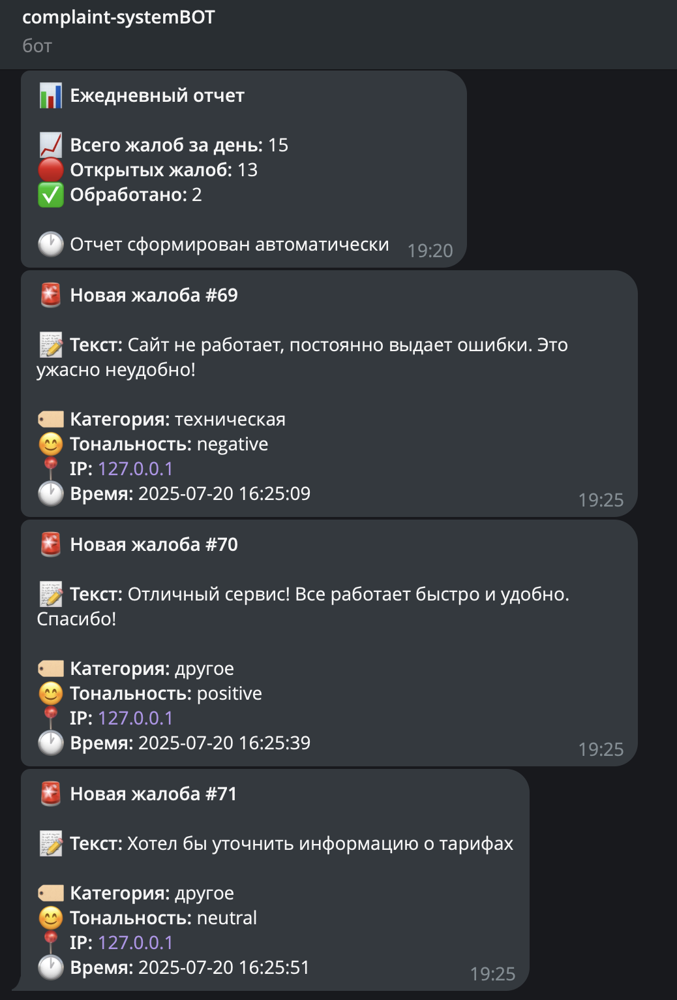
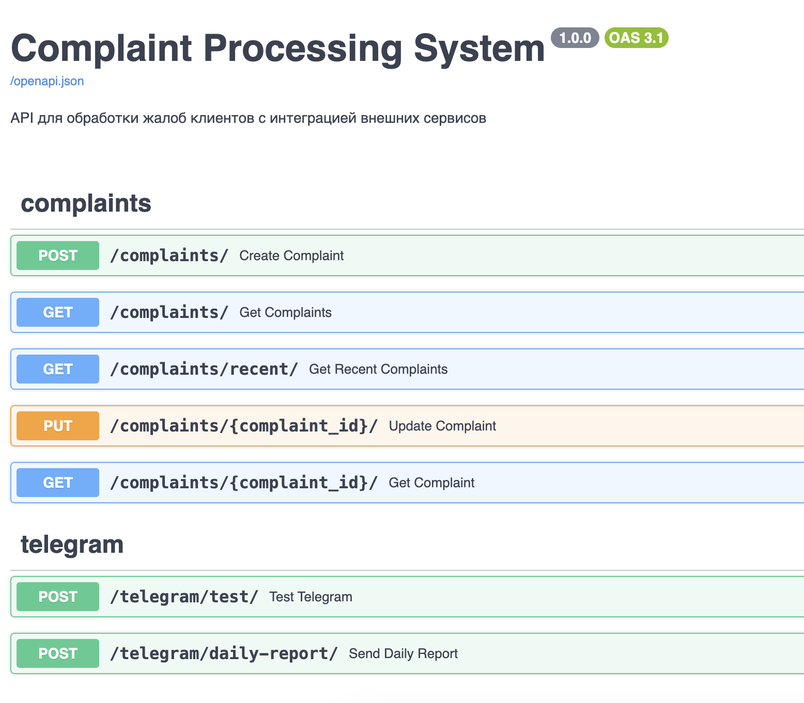
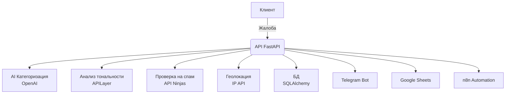
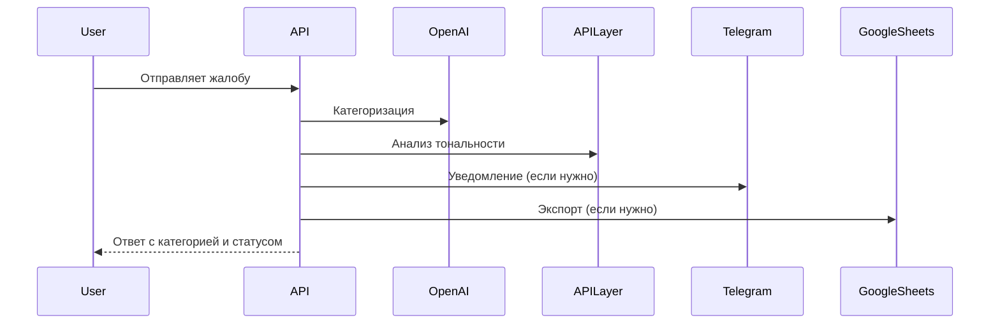

# 🤖 Complaint System — AI-powered Customer Complaint Platform

<p align="center">
  
  
  
  
  
  
  
  
  
</p>

---

<p align="center">
  <b>Современная система обработки жалоб клиентов с поддержкой искусственного интеллекта</b><br>
  <i>Автоматическая категоризация, анализ тональности, уведомления в реальном времени, интеграция с Telegram, Google Sheets и OpenAI</i>
</p>

---

## 🖼️ Скриншоты

<p align="center">
  
  
</p>

---

## 🚦 Архитектура проекта



---

## ✨ Возможности

| 🚀 Функция                | 📝 Описание                                                                 |
|--------------------------|-----------------------------------------------------------------------------|
| ⚡ REST API               | Современный FastAPI с автодокументацией                                     |
| 🤖 AI-категоризация       | GPT-3.5 Turbo + fallback на ключевые слова                                  |
| 😊 Анализ тональности     | APILayer Sentiment Analysis, поддержка русского языка                       |
| 🚫 Проверка на спам       | API Ninjas                                                                  |
| 🌍 Геолокация             | IP API                                                                      |
| 🔔 Telegram уведомления   | Мгновенные оповещения о важных жалобах                                      |
| 📊 Google Sheets экспорт  | Автоматический экспорт жалоб                                                |
| 🔄 n8n интеграция         | Автоматизация бизнес-процессов                                              |
| 🧪 Тесты                  | Unit, integration, API, Makefile                                            |
| 🐳 Docker                 | Готовность к продакшену, контейнеризация                                    |

---

## 🛠️ Технологии

<p align="center">
  
  
  
  
  
  
  
</p>

---

## 📦 Внешние сервисы

- **OpenAI GPT-3.5 Turbo** — AI-категоризация жалоб
- **APILayer Sentiment Analysis** — анализ тональности
- **API Ninjas Spam Check** — проверка на спам
- **IP API** — геолокация по IP
- **Telegram Bot API** — уведомления
- **Google Sheets API** — экспорт данных

---

## 🗂️ Структура проекта

<details>
<summary>Показать структуру</summary>

```
complaint-system/
├── app/
│   ├── config.py
│   ├── models/
│   ├── routes/
│   ├── services/
│   └── utils/
├── docs/
│   ├── QUICK_START.md
│   ├── DEPLOYMENT.md
│   ├── TESTING.md
│   ├── TELEGRAM_SETUP.md
│   ├── GOOGLE_SHEETS_SETUP.md
│   ├── n8n_setup.md
│   └── PROJECT_SUMMARY.md
├── tests/
│   ├── api/
│   ├── integration/
│   ├── unit/
│   └── run_all_tests.py
├── main.py
├── database.py
├── models.py
├── services.py
├── requirements.txt
├── env.example
├── run.sh
├── Makefile
├── docker-compose.yml
├── Dockerfile
├── n8n_workflow.json
└── README.md
```
</details>

---

## ⚡ Быстрый старт

```bash
git clone https://github.com/zavet-g/complaint-system.git
cd complaint-system
cp env.example .env
make install
make run
# или через Docker
make docker-run
```
- Документация API: [http://localhost:8000/docs](http://localhost:8000/docs)

---

## 🧪 Тестирование

```bash
make test           # Все тесты
make test-api       # Только API
make test-unit      # Только unit
make test-integration # Только интеграционные
```

---

## 📝 Документация

- [Быстрый старт](docs/QUICK_START.md)
- [Развёртывание](docs/DEPLOYMENT.md)
- [Тестирование](docs/TESTING.md)
- [Настройка Telegram](docs/TELEGRAM_SETUP.md)
- [Настройка Google Sheets](docs/GOOGLE_SHEETS_SETUP.md)
- [Настройка n8n](docs/n8n_setup.md)
- [Обзор проекта](docs/PROJECT_SUMMARY.md)

---

## 🧩 Как это работает



---

## 🤝 Вклад

1. Fork репозитория
2. Создайте ветку (`git checkout -b feature/your-feature`)
3. Commit (`git commit -m 'Add your feature'`)
4. Push (`git push origin feature/your-feature`)
5. Откройте Pull Request

---

## 👤 Автор и связь

> **Артём Букарев**  
> Telegram: [@bcdbcddd](https://t.me/bcdbcddd)  
> GitHub: [zavet-g/complaint-system](https://github.com/zavet-g/complaint-system)

---

## ⭐️ Поддержите проект!

Если проект был полезен — поставьте ⭐️ на [GitHub](https://github.com/zavet-g/complaint-system)!

---

## 🎉 Благодарности

<p align="center">
  
  
  
  
  
  
</p> 